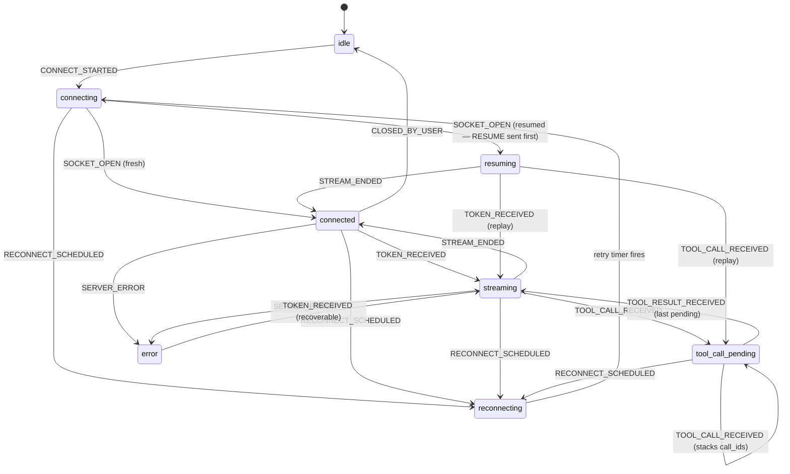

# Alchemyst Agent Console

A Next.js (App Router, strict TypeScript) console for a streaming WebSocket agent. A dependency-free protocol layer (SequenceBuffer for dedup/reorder/gap-tolerance, ConnectionManager for backoff + RESUME + fast-path PONG/TOOL_ACK, and a pure-reducer FSM) feeds three subscription-based stores; React components consume them via `useSyncExternalStore`, with streaming tokens appended straight to stable DOM nodes so token throughput never touches React state.

## Connection state machine



## Run

```bash
# 1. Start the agent server (mock implementation in ./agent-server)
cd agent-server && npm install && npm start          # ws://localhost:4747/ws
#   chaos mode: npm run start:chaos
#   or Docker:  docker compose up   (MODE=chaos docker compose up)

# 2. Build and run the console — no env vars needed
npm install
npm run build
npm run start                          # http://localhost:3000
```

Dev mode: `npm run dev`. Tests: `npm test` (protocol layer + diff engine, 41 tests).

## Screenshots / recordings

> _Placeholders — capture against `agent-server --mode normal` and `--mode chaos`._

| Scenario | Capture |
| --- | --- |
| Streaming chat with stacked tool cards | _screenshot here_ |
| Timeline ↔ chat bidirectional highlight | _screenshot here_ |
| Context inspector diff + history scrubber | _screenshot here_ |
| Reconnect: drop banner → RESUME → stitched replay | _recording here_ |
| Chaos mode session | _recording here_ |

## Layout

- `src/lib/protocol/` — pure TS protocol layer + unit tests (no React imports)
- `src/lib/session/` — composition root and per-feature stores
- `src/lib/diff/` — chunked structural diff engine + tests
- `src/components/` — chat (Task 1), timeline (Task 2), context (Task 3), connection banner (Task 4)
- `src/lib/escape-hatch.ts` — the one file allowed to contain `any` (it is empty)

See `DECISIONS.md` for design rationale and known gaps.
